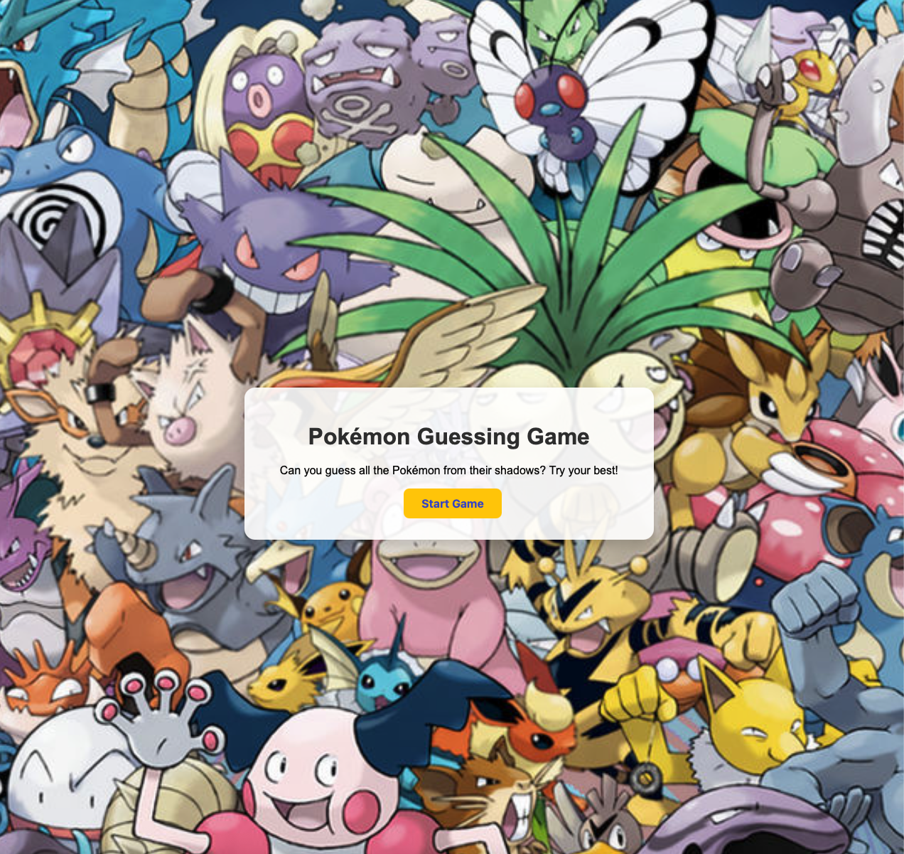

# Pokémon Guessing Game 🎮

A fun Pokémon guessing game built with **Python** and **Flask**.  
Guess the Pokémon from its shadow! You have 3 tries per Pokémon. Tracks score and shows the correct answer if you miss.

## Features
- Generation 1 Pokémon only
- Random Pokémon selection, no repeats until all 10 are used
- Tracks number of correct guesses
- Stylish UI with CSS and Pokémon images
- Play again button to restart the game

## How to Run Locally
1. Clone the repo:
   ```bash
   git clone https://github.com/apin1992/pokemon_guess_game.git

